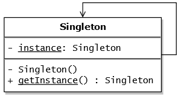

# singleton-pattern-example-nodejs

Repositorio de aplicación en NodeJS Javascript (ES6) utilizando Singleton Pattern.

Definición:

Es un patrón de diseño que permite restringir la creación de objetos pertenecientes a una clase o el valor de un tipo a un único objeto.

Su intención consiste en garantizar que una clase solo tenga una instancia y proporcionar un punto de acceso global a ella.

Diagrama UML:

Beneficios:

1) Solo una instancia de esa clase en la aplicación entera
2) Puedes acceder a ella desde diferentes partes de la aplicación.
3) Quieres que su información persista incluso si actualmente no hay referencias a ella.

Otros ejemplos:

1) Carga inicial de recursos en memoria
2) Conexion a base de datos

Autor: Jesús Kahwati
